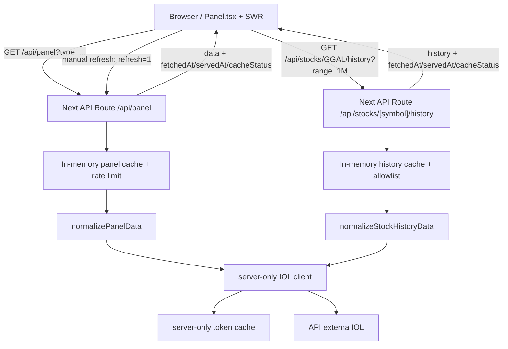

# Argentina Market Tracker

[](https://github.com/emanueltivano/argentina-market-tracker/actions/workflows/ci.yml)


Fullstack market dashboard for Argentine equities built with Next.js, React,
TypeScript and Tailwind CSS.

The app consumes a protected external API, keeps credentials server-side through
a Next.js backend-for-frontend, validates and normalizes market payloads, and
renders a responsive dashboard with historical charts, persisted favorites,
loading/error/empty/stale states and automated tests.

It is designed as a professional portfolio project: small enough to review in an
interview, but complete enough to show product thinking, frontend craft,
server-side boundaries, data contracts and deployment awareness.

## Quick Start

```bash
npm install
cp .env.local.example .env.local
npm run dev
```

Open `http://localhost:3000`.

The project requires external API credentials for live data. The Playwright E2E
suite mocks `/api/panel`, so tests do not depend on real credentials.

## Stack

- Next.js 16 App Router
- React 19
- TypeScript 6
- Tailwind CSS 4
- SWR
- `lightweight-charts`
- Vitest
- Playwright

## Key Features

- Secure backend-for-frontend with Next API routes.
- Server-only OAuth token handling and credential protection.
- Validated market panel and historical price contracts.
- Responsive dashboard for leader, general, CEDEAR and favorite panels.
- Manual refresh, short in-memory cache, request deduplication and rate limit.
- Historical detail modal with range selector and chart rendering.
- Local favorites with stale fallback snapshots.
- Loading, empty, error, stale and refreshing UI states.
- CI with lint, type-check, unit/integration tests, E2E and production build.

## What This Project Demonstrates

- **Frontend architecture:** composable dashboard components, hooks for data
  fetching and persistence, responsive table behavior and accessible controls.
- **Fullstack boundaries:** API routes hide external credentials, normalize
  upstream data and expose stable contracts to the client.
- **Data resilience:** runtime guards prevent invalid external payloads from
  leaking into the UI.
- **Operational thinking:** cache, cooldown, timeout, retry and rate limiting are
  implemented with documented serverless tradeoffs.
- **Quality:** unit tests, API tests, hook/component tests and Playwright E2E are
  part of the normal validation path.

## Screenshots

### Desktop


### Modal con histórico


### Mobile


## Architecture Summary

```txt
Browser
  Dashboard + SWR
        |
        | GET /api/panel?type=lider|general|cedears
        | GET /api/stocks/[symbol]/history?range=...
        v
Next API Routes
  Validate request, apply local cache/rate limit, normalize payloads
        |
        v
Server-only IOL client
  OAuth token cache, timeout, retry, credential redaction
        |
        v
External market API
```

The browser only receives validated app-level data. External credentials,
token refresh and upstream error details stay in the server layer.

## Quality Checks

```bash
npm run lint
npm run type-check
npm run test
npm run build
npm run test:e2e:run
```

`npm run validate` runs lint, type-check, unit/integration tests and build.

## Known Limitations / Next Improvements

- No public demo URL is documented yet. Configure Vercel environment variables
  before publishing the repository as a live portfolio link.
- In-memory cache and rate limiting are per process/serverless instance. Use
  Redis, Vercel KV, Upstash or WAF rules for real production traffic.
- Historical data is fetched on demand and not persisted in a database.
- No analytics or production error reporting is wired yet.
- A strict CSP is intentionally not enabled until Next.js generated assets and
  runtime scripts are audited.

## Descripcion En Espanol

Dashboard de mercado argentino construido con Next.js, React, TypeScript y
Tailwind CSS. Consume una API externa protegida por token, normaliza paneles de
mercado, expone historicos por simbolo y los muestra en una interfaz con
estados de carga, error, vacio, datos stale y favoritos persistidos localmente.

## Arquitectura y seguridad

La API externa requiere credenciales y token OAuth. Por eso el navegador nunca llama directo al proveedor: el frontend consulta `/api/panel` y esa API route actúa como backend-for-frontend. Esta capa permite mantener `API_USERNAME`, `API_PASSWORD` y el token de acceso solo del lado server, normalizar respuestas externas antes de enviarlas al cliente y devolver errores controlados.

El cliente server-side vive en `src/lib/server/iol.ts` y está protegido con `server-only` para evitar imports accidentales desde componentes cliente. Además centraliza timeout, cache de token, retry único ante `401/403` y redacción básica de credenciales en mensajes de error.

Las API routes no intentan ser un backend financiero completo. Su rol es acotado:
validar entradas, aplicar cache/cooldown/rate limit local, llamar al upstream,
normalizar payloads y entregar contratos estables al frontend. `/api/panel`
sirve paneles de mercado; `/api/stocks/[symbol]/history` sirve históricos
normalizados para el modal de detalle.

## Calidad y operación

- CI con GitHub Actions ejecutando lint, type-check, tests y build en Node 20.
- Tests unitarios, de integración livianos y E2E con Playwright mockeando `/api/panel`.
- Credenciales manejadas solo server-side mediante API routes y cliente `server-only`.
- Cache corto, deduplicación, timeout y retry controlado para llamadas a la API externa.
- Estados de UI diferenciados para carga inicial con skeletons, refresh, errores con datos previos, errores sin datos, datos stale, favoritos y paneles vacíos.
- Refresh manual con bypass del cache en memoria usando `refresh=1`.
- Rutas de debug restringidas a `NODE_ENV !== "production"`, `ENABLE_TOKEN_DEBUG=1` y host local.

## Cache en memoria

`/api/panel` usa un cache en memoria por panel y deduplica requests concurrentes dentro del mismo proceso. `/api/stocks/[symbol]/history` usa un cache en memoria por `market:symbol:range`, con TTL, pruning de expirados y límite máximo de keys. Esto reduce llamadas repetidas a la API externa, pero en entornos serverless no debe asumirse como cache compartido ni persistente: cada instancia puede tener su propio cache y puede perderlo entre invocaciones.

Las respuestas HTTP de las API internas usan `Cache-Control: no-store`. La decisión es intencional: para datos financieros se evita que navegador/CDN sirvan datos obsoletos fuera del control de la app. El cache corto vive dentro del server para absorber ráfagas contra la API externa y la UI muestra frescura mediante `fetchedAt`, `servedAt` y `cacheStatus`.

## Rate limit

`/api/panel` y `/api/stocks/[symbol]/history` aplican un rate limit simple en memoria de 120 requests por minuto por IP detectada desde `x-forwarded-for` o `x-real-ip`. Es suficiente para un portfolio y no requiere servicios pagos, pero tiene las mismas limitaciones serverless que el cache: cada instancia mantiene su propio contador. Para producción con tráfico real, reemplazarlo por un store compartido como Redis, Vercel KV o una regla de WAF.

El refresh manual con `refresh=1` tiene además un cooldown en memoria de 15 segundos por panel y client key/IP. Esto evita refrescos manuales excesivos contra la API externa dentro de una misma instancia, pero tampoco es un límite global distribuido en serverless.

En una producción real con tráfico público, el rate limit debería vivir fuera del proceso: Redis, Vercel KV/Upstash o una regla de WAF/CDN. Eso permitiría compartir contadores entre instancias, aplicar ventanas por IP/API key y bloquear abuso antes de ejecutar la función serverless.

El auto-refresh del dashboard usa requests normales a `/api/panel` para que este cache corto del server absorba ráfagas entre clientes. Solo el botón manual usa `refresh=1` para pedir datos frescos saltando el cache local.

## Debug local

Las herramientas de debug están deshabilitadas por defecto. `/api/token` y `/api/panel?raw=1` solo responden cuando se cumplen todas estas condiciones:

- `NODE_ENV !== "production"`
- `ENABLE_TOKEN_DEBUG=1`
- la request llega por `localhost`, `127.0.0.1` o `::1`

Estas rutas nunca devuelven el token completo. `raw=1` puede exponer estructura de la API externa, por eso queda limitado a desarrollo local.

## Arquitectura



```txt
Browser
  Panel.tsx + SWR
        |
        | fetch /api/panel?type=lider|general|cedears
        | fetch /api/stocks/[symbol]/history?range=...
        v
Next API Route
  src/app/api/panel/route.ts
  src/app/api/stocks/[symbol]/history/route.ts
        |
        | cache corto por MarketPanelKey
        | normalización con normalizePanelData()
        | cache bounded por market:symbol:range
        | normalización con normalizeStockHistoryData()
        v
Server-only client
  src/lib/server/iol.ts
        |
        | token cache + timeout + retry ante 401/403
        v
API externa
```

## Flujo de datos

1. El usuario abre el dashboard.
2. `Panel.tsx` consulta `/api/panel` usando SWR.
3. La API route valida el panel solicitado (`lider`, `general`, `cedears`).
4. Si existe cache vigente, responde desde memoria.
5. Si el usuario fuerza refresh, consulta la API externa con `refresh=1` y actualiza el cache.
6. Si no existe cache, `iolFetch` obtiene/reutiliza token y consulta la API externa.
7. `normalizePanelData` valida el payload externo.
8. El frontend recibe solo datos normalizados y metadata de frescura.
9. La UI mapea cada título a una fila de mercado.
10. Al abrir un detalle, el modal consulta `/api/stocks/[symbol]/history`.
11. El histórico se normaliza en server y se renderiza con `lightweight-charts`.
12. Los favoritos guardan snapshots locales para renderizar filas stale si falla el panel fuente.

## Estructura

```txt
src/
  app/
    api/
      panel/
      stocks/[symbol]/history/
      token/
    dashboard/
      components/
      hooks/
      lib/
    globals.css
    layout.tsx
    page.tsx

  lib/
    market.ts
    panel.ts
    server/
      env.ts
      iol.ts
      tokenCache.ts
```

## Scripts

| Script | Descripción |
| --- | --- |
| `npm run dev` | Levanta Next en desarrollo en el puerto 3000 |
| `npm run lint` | Ejecuta ESLint |
| `npm run type-check` | Valida TypeScript sin emitir archivos |
| `npm run test` | Corre tests unitarios con Vitest |
| `npm run test:e2e` | Genera build y corre E2E con Playwright y mocks de `/api/panel` |
| `npm run test:e2e:run` | Corre E2E contra un build ya generado |
| `npm run test:e2e:ui` | Abre el runner interactivo de Playwright |
| `npm run build` | Genera build de producción |
| `npm run validate` | Ejecuta lint, type-check, tests unitarios y build |
| `npm run start` | Sirve el build de producción |
| `npm run deps:update` | Actualiza dependencias con npm-check-updates |

## CI

El repositorio incluye GitHub Actions en `.github/workflows/ci.yml`.

El workflow corre en `push` y `pull_request` con Node 20, cache de npm y la misma validación recomendada para cambios locales:

```bash
npm ci
npm run lint
npm run type-check
npm run test
npm run build
npm run test:e2e:run
```

El job instala solo Chromium (`npx playwright install --with-deps chromium`) para mantener el pipeline razonable en tiempo y peso. Los E2E interceptan `/api/panel`, por lo que no llaman a la API externa ni dependen de credenciales reales.

## Portfolio notes

Configuración sugerida para GitHub:

- Descripción: `Market dashboard for Argentine equities with secure BFF, historical charts, caching, rate limiting and tests.`
- Topics: `nextjs`, `typescript`, `react`, `tailwindcss`, `playwright`, `vitest`, `portfolio`, `bff`, `financial-dashboard`
- Website: URL del deploy público.
- Release/tag sugerido para cierre de portfolio: `v1.0.0`.

## Variables de entorno

Crear `.env.local` a partir de `.env.local.example`.

| Variable | Requerida | Descripción |
| --- | --- | --- |
| `API_URL` | Sí | URL base de la API externa, sin slash final |
| `NEXT_PUBLIC_SITE_URL` | No | URL pública del sitio para metadata social; default local |
| `TOKEN_ENDPOINT` | No | Endpoint de token; default `token` |
| `API_USERNAME` | Sí | Usuario de API externa |
| `API_PASSWORD` | Sí | Password de API externa |
| `PANEL_LIDER_ENDPOINT` | Sí | Endpoint del panel líder |
| `PANEL_GENERAL_ENDPOINT` | Sí | Endpoint del panel general |
| `PANEL_CEDEARS_ENDPOINT` | Sí | Endpoint de CEDEARs |
| `ENABLE_TOKEN_DEBUG` | No | Habilita herramientas de debug local cuando vale `1` |

Ejemplo:

```env
API_URL="https://api.example.com"
NEXT_PUBLIC_SITE_URL="http://localhost:3000"
TOKEN_ENDPOINT="token"
API_USERNAME="your_api_username"
API_PASSWORD="your_api_password"
PANEL_LIDER_ENDPOINT="api/v2/cotizaciones/acciones/merval/argentina"
PANEL_GENERAL_ENDPOINT="api/v2/cotizaciones/acciones/panel%20general/argentina"
PANEL_CEDEARS_ENDPOINT="api/v2/cotizaciones/acciones/cedears/argentina"
ENABLE_TOKEN_DEBUG=0
```

## Puesta en marcha local

```bash
npm install
cp .env.local.example .env.local
npm run dev
```

Abrir:

```txt
http://localhost:3000
```

Para datos reales, completar `.env.local` con credenciales del proveedor. El
repositorio no incluye secretos ni un modo demo público con datos mockeados para
producción; los tests usan mocks donde corresponde.

## Deploy en Vercel

1. Importar el repositorio en Vercel.
2. Configurar las variables de entorno requeridas en Project Settings.
3. Mantener `ENABLE_TOKEN_DEBUG=0` o sin definir en producción.
4. Ejecutar el build con `npm run build`.
5. Agregar la URL pública al campo Website de GitHub cuando el deploy esté validado.

### Deploy checklist

- Validar variables de entorno en Vercel: `API_URL`, `API_USERNAME`, `API_PASSWORD` y endpoints de panel.
- Definir `NEXT_PUBLIC_SITE_URL` con la URL final de Vercel cuando exista dominio público.
- Mantener `ENABLE_TOKEN_DEBUG` sin definir o en `0`.
- Confirmar que ninguna variable sensible queda expuesta con prefijo `NEXT_PUBLIC_`; solo `NEXT_PUBLIC_SITE_URL` debe ser pública.
- Correr `npm run validate`.
- Correr `npm run test:e2e`.
- Probar manualmente panel inicial, cambio de panel, refresh, modal histórico, favoritos y mobile.
- Compartir solo una demo con credenciales reales configuradas del lado server o con un modo demo explícito implementado.

### Production tradeoffs

- `Cache-Control: no-store` evita caches externos opacos para datos financieros; el costo es que cada navegación/revalidación pasa por la API route.
- El cache y rate limit en memoria son deliberadamente simples. Funcionan bien para portfolio y demos, pero no son compartidos entre instancias serverless.
- El refresh manual usa `refresh=1` para saltear el cache local y actualizar `fetchedAt`, con cooldown local de 15 segundos por panel y client key/IP.
- La ruta de históricos acepta solo markets permitidos explícitamente. Hoy el frontend usa `bCBA`.
- HSTS se agrega solo en producción. No se fuerza en desarrollo para evitar efectos indeseados sobre `localhost`.
- No se agrega CSP todavía: una CSP útil en Next.js requiere auditar scripts, styles y assets generados por el framework. Agregar una política incompleta podría romper deploy o dar una falsa sensación de seguridad.

### Fuera del MVP

- Rate limit global distribuido con Redis/KV/WAF.
- Persistencia histórica de precios o base de datos propia.
- Observabilidad productiva completa: métricas, tracing, alertas y dashboard de errores.
- Autenticación de usuarios finales.
- CSP estricta auditada para todos los assets/scripts de Next.js.

## Tests

Los tests actuales cubren lógica crítica, contratos de datos y flujos principales de UI:

- `src/lib/panel.test.ts`
- `src/lib/market.test.ts`
- `src/lib/formatters.test.ts`
- `src/lib/server/tokenCache.test.ts`
- `src/lib/server/iol.test.ts`
- `src/app/api/panel/route.test.ts`
- `src/app/api/stocks/[symbol]/history/route.test.ts`
- `src/app/api/token/route.test.ts`
- `src/app/dashboard/hooks/useMarketPanel.test.ts`
- `src/app/dashboard/hooks/useStockHistory.test.tsx`
- `src/app/dashboard/hooks/useFavoriteStocks.test.tsx`
- `src/app/dashboard/components/Panel.test.tsx`
- `src/app/dashboard/components/StockDetailsModal.test.tsx`
- `src/app/dashboard/components/LightweightStockChart.test.tsx`
- `src/app/dashboard/components/PanelLoadingSkeleton.test.tsx`
- `e2e/dashboard.spec.ts`

La cobertura se enfoca en normalización de payloads externos, cache de token, retry/timeout del cliente IOL, contratos de API, rate limit/cooldown local, cache bounded de históricos, allowlist de markets, hooks de panel e histórico, favoritos con snapshots stale, skeleton loading, modal/chart y E2E con `/api/panel` mockeado. Los tests no hacen requests reales al proveedor externo ni dependen de credenciales reales.

Comandos recomendados antes de publicar cambios:

```bash
npm run validate
npm run test:e2e
```

### E2E local

Instalar el browser de Playwright la primera vez:

```bash
npx playwright install chromium
```

Correr los E2E:

```bash
npm run test:e2e
```

Abrir el runner interactivo:

```bash
npm run test:e2e:ui
```

Playwright levanta `next start` sobre un build de producción y mockea `/api/panel`, así que los tests no usan IOL ni requieren credenciales.

## Troubleshooting

- `Missing API_URL` o `Missing PANEL_*_ENDPOINT`: revisar `.env.local` contra `.env.local.example`.
- `PANEL_ERROR` en producción: la UI oculta detalles sensibles; reproducir localmente con env vars correctas para ver detalles.
- `HISTORY_ERROR` en producción: revisar localmente el endpoint histórico con el mismo símbolo/rango; en producción no se exponen detalles del upstream.
- Refresh manual no cambia datos: puede que la API externa haya devuelto la misma cotización; revisar `fetchedAt` para confirmar que hubo nueva consulta.
- 429 en `/api/panel`: se superó el rate limit local de 120 requests por minuto para la misma IP.
- 429 en `/api/stocks/[symbol]/history`: se superó el rate limit local de históricos para la misma IP.
- `/api/token` devuelve 404: es esperado salvo desarrollo local con `ENABLE_TOKEN_DEBUG=1`.

## Próximas mejoras

- Reemplazar rate limit/cooldown in-memory por un límite global si la app recibe tráfico público real.
- Agregar observabilidad básica de errores y latencia de upstream.
- Mejorar la experiencia mobile con más pruebas visuales y ajustes de densidad.
- Persistir o precalcular históricos si se necesita análisis offline o comparación entre sesiones.
