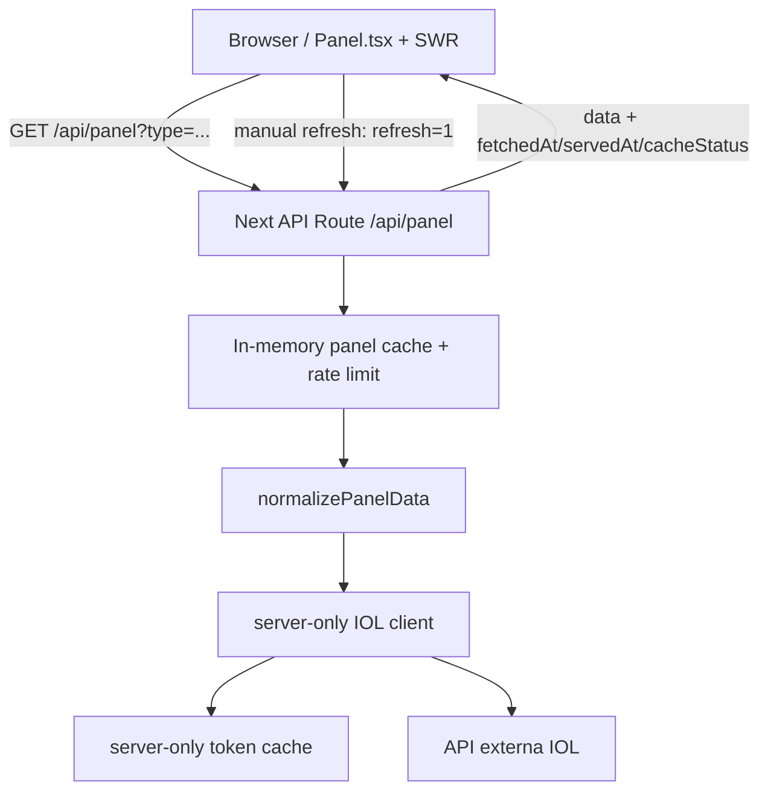

# Argentina Market Tracker

[](https://github.com/emanueltivano/argentina-market-tracker/actions/workflows/ci.yml)


Dashboard de mercado argentino construido con Next.js, React, TypeScript y Tailwind CSS.

El proyecto consume una API externa protegida por token, normaliza paneles de mercado
argentino y los muestra en una interfaz simple con estados de carga, error, vacío y datos.
Está pensado como proyecto de portfolio: prioriza claridad, seguridad básica, buen tipado,
tests y una arquitectura fácil de explicar en entrevista.

## Screenshots

### Desktop


## Decisiones técnicas destacadas

- API route interna para proteger credenciales y evitar llamadas directas desde el navegador.
- Cliente server-side aislado con `server-only`.
- Cache corto y deduplicación de requests en vuelo para reducir llamadas repetidas a la API externa.
- Respuestas de `/api/panel` con `fetchedAt`, `servedAt` y `cacheStatus` para mostrar frescura de datos.
- Rate limit simple en memoria para proteger el endpoint público sin requerir infraestructura paga.
- Headers HTTP conservadores para seguridad y política explícita de cache.
- Normalización de datos antes de renderizar en la UI.
- TypeScript estricto, lint y tests unitarios para lógica crítica.
- Formatters compartidos para mantener consistente la salida visual de precios, enteros y porcentajes.

## Production readiness

- CI con GitHub Actions ejecutando lint, type-check, tests y build en Node 20.
- Tests unitarios, de integración livianos y E2E con Playwright mockeando `/api/panel`.
- Credenciales manejadas solo server-side mediante API routes y cliente `server-only`.
- Cache corto, deduplicación, timeout y retry controlado para llamadas a la API externa.
- Estados de UI diferenciados para carga inicial, refresh, errores con datos previos, errores sin datos y paneles vacíos.
- Refresh manual con bypass del cache en memoria usando `refresh=1`.
- Rutas de debug restringidas a `NODE_ENV !== "production"`, `ENABLE_TOKEN_DEBUG=1` y host local.

## Cache en memoria

`/api/panel` usa un cache en memoria por panel y deduplica requests concurrentes dentro del mismo proceso. Esto reduce llamadas repetidas a la API externa, pero en entornos serverless no debe asumirse como cache compartido ni persistente: cada instancia puede tener su propio cache y puede perderlo entre invocaciones.

La respuesta HTTP de `/api/panel` usa `Cache-Control: no-store`. La decisión es intencional: para datos financieros se evita que navegador/CDN sirvan datos obsoletos fuera del control de la app. El cache corto vive dentro del server para absorber ráfagas contra la API externa y la UI muestra frescura mediante `fetchedAt`, `servedAt` y `cacheStatus`.

## Rate limit

`/api/panel` aplica un rate limit simple en memoria de 120 requests por minuto por IP detectada desde `x-forwarded-for` o `x-real-ip`. Es suficiente para un portfolio y no requiere servicios pagos, pero tiene las mismas limitaciones serverless que el cache: cada instancia mantiene su propio contador. Para producción con tráfico real, reemplazarlo por un store compartido como Redis, Vercel KV o una regla de WAF.

## Debug local

Las herramientas de debug están deshabilitadas por defecto. `/api/token` y `/api/panel?raw=1` solo responden cuando se cumplen todas estas condiciones:

- `NODE_ENV !== "production"`
- `ENABLE_TOKEN_DEBUG=1`
- la request llega por `localhost`, `127.0.0.1` o `::1`

Estas rutas nunca devuelven el token completo. `raw=1` puede exponer estructura de la API externa, por eso queda limitado a desarrollo local.

## Stack

- Next.js 16
- React 19
- TypeScript 6
- Tailwind CSS 4
- SWR
- ESLint
- Vitest
- Playwright

## Arquitectura



```txt
Browser
  Panel.tsx + SWR
        |
        | fetch /api/panel?type=lider|general|cedears
        v
Next API Route
  src/app/api/panel/route.ts
        |
        | cache corto por MarketPanelKey
        | normalización con normalizePanelData()
        v
Server-only client
  src/lib/server/iol.ts
        |
        | token cache + timeout + retry ante 401/403
        v
API externa
```

## Flujo de datos

1. El usuario abre el dashboard.
2. `Panel.tsx` consulta `/api/panel` usando SWR.
3. La API route valida el panel solicitado (`lider`, `general`, `cedears`).
4. Si existe cache vigente, responde desde memoria.
5. Si el usuario fuerza refresh, consulta la API externa con `refresh=1` y actualiza el cache.
6. Si no existe cache, `iolFetch` obtiene/reutiliza token y consulta la API externa.
7. `normalizePanelData` valida el payload externo.
8. El frontend recibe solo datos normalizados y metadata de frescura.
9. La UI mapea cada título a una fila de mercado.

## Estructura

```txt
src/
  app/
    api/
      panel/
      token/
    dashboard/
      components/
    globals.css
    layout.tsx
    page.tsx

  lib/
    market.ts
    panel.ts
    server/
      env.ts
      iol.ts
      tokenCache.ts
```

## Scripts

| Script | Descripción |
| --- | --- |
| `npm run dev` | Levanta Next en desarrollo en el puerto 3000 |
| `npm run lint` | Ejecuta ESLint |
| `npm run type-check` | Valida TypeScript sin emitir archivos |
| `npm run test` | Corre tests unitarios con Vitest |
| `npm run test:e2e` | Corre E2E con Playwright y mocks de `/api/panel` |
| `npm run test:e2e:ui` | Abre el runner interactivo de Playwright |
| `npm run build` | Genera build de producción |
| `npm run start` | Sirve el build de producción |
| `npm run deps:update` | Actualiza dependencias con npm-check-updates |

## CI

El repositorio incluye GitHub Actions en `.github/workflows/ci.yml`.

El workflow corre en `push` y `pull_request` con Node 20, cache de npm y la misma validación recomendada para cambios locales:

```bash
npm ci
npm run lint
npm run type-check
npm run test
npm run test:e2e
npm run build
```

El job instala solo Chromium (`npx playwright install --with-deps chromium`) para mantener el pipeline razonable en tiempo y peso. Los E2E interceptan `/api/panel`, por lo que no llaman a la API externa ni dependen de credenciales reales.

## Variables de entorno

Crear `.env.local` a partir de `.env.local.example`.

| Variable | Requerida | Descripción |
| --- | --- | --- |
| `API_URL` | Sí | URL base de la API externa, sin slash final |
| `TOKEN_ENDPOINT` | No | Endpoint de token; default `token` |
| `API_USERNAME` | Sí | Usuario de API externa |
| `API_PASSWORD` | Sí | Password de API externa |
| `PANEL_LIDER_ENDPOINT` | Sí | Endpoint del panel líder |
| `PANEL_GENERAL_ENDPOINT` | Sí | Endpoint del panel general |
| `PANEL_CEDEARS_ENDPOINT` | Sí | Endpoint de CEDEARs |
| `ENABLE_TOKEN_DEBUG` | No | Habilita herramientas de debug local cuando vale `1` |
| `NEXT_PUBLIC_APP_ORIGIN` | No | Origen público de la app si se usan Server Actions |

Ejemplo:

```env
API_URL="https://api.example.com"
TOKEN_ENDPOINT="token"
API_USERNAME="your_api_username"
API_PASSWORD="your_api_password"
PANEL_LIDER_ENDPOINT="api/v2/cotizaciones/acciones/merval/argentina"
PANEL_GENERAL_ENDPOINT="api/v2/cotizaciones/acciones/panel%20general/argentina"
PANEL_CEDEARS_ENDPOINT="api/v2/cotizaciones/acciones/cedears/argentina"
ENABLE_TOKEN_DEBUG=0
NEXT_PUBLIC_APP_ORIGIN="https://your-vercel-app.vercel.app"
```

## Puesta en marcha local

```bash
npm install
cp .env.local.example .env.local
npm run dev
```

Abrir:

```txt
http://localhost:3000
```

## Deploy en Vercel

1. Importar el repositorio en Vercel.
2. Configurar las variables de entorno requeridas.
3. Definir `NEXT_PUBLIC_APP_ORIGIN` con el dominio público si se mantienen Server Actions habilitadas.
4. Mantener `ENABLE_TOKEN_DEBUG=0` o sin definir en producción.
5. Ejecutar el build con `npm run build`.

### Production tradeoffs

- `Cache-Control: no-store` evita caches externos opacos para datos financieros; el costo es que cada navegación/revalidación pasa por la API route.
- El cache y rate limit en memoria son deliberadamente simples. Funcionan bien para portfolio y demos, pero no son compartidos entre instancias serverless.
- El refresh manual usa `refresh=1` para saltear el cache local y actualizar `fetchedAt`.
- No se agrega CSP estricta todavía para evitar romper scripts/assets de Next.js sin una auditoría dedicada.

## Tests

Los tests actuales cubren lógica crítica y algunos contratos server-side:

- `src/lib/panel.test.ts`
- `src/lib/market.test.ts`
- `src/lib/formatters.test.ts`
- `src/lib/server/tokenCache.test.ts`
- `src/app/api/panel/route.test.ts`
- `src/app/api/token/route.test.ts`
- `src/app/dashboard/components/Panel.test.tsx`
- `src/app/dashboard/components/StockDetailsModal.test.tsx`
- `e2e/dashboard.spec.ts`

Comandos recomendados antes de publicar cambios:

```bash
npm run lint
npm run type-check
npm run test
npm run test:e2e
npm run build
```

### E2E local

Instalar el browser de Playwright la primera vez:

```bash
npx playwright install chromium
```

Correr los E2E:

```bash
npm run test:e2e
```

Abrir el runner interactivo:

```bash
npm run test:e2e:ui
```

Playwright levanta `npm run dev:e2e` automáticamente y mockea `/api/panel`, así que los tests no usan IOL ni requieren credenciales.

## Troubleshooting

- `Missing API_URL` o `Missing PANEL_*_ENDPOINT`: revisar `.env.local` contra `.env.local.example`.
- `PANEL_ERROR` en producción: la UI oculta detalles sensibles; reproducir localmente con env vars correctas para ver detalles.
- Refresh manual no cambia datos: puede que la API externa haya devuelto la misma cotización; revisar `fetchedAt` para confirmar que hubo nueva consulta.
- 429 en `/api/panel`: se superó el rate limit local de 120 requests por minuto para la misma IP.
- `/api/token` devuelve 404: es esperado salvo desarrollo local con `ENABLE_TOKEN_DEBUG=1`.

## Próximas mejoras

- Agregar visualización histórica de precios.
- Agregar más filtros y opciones de búsqueda.
- Mejorar la experiencia mobile.
