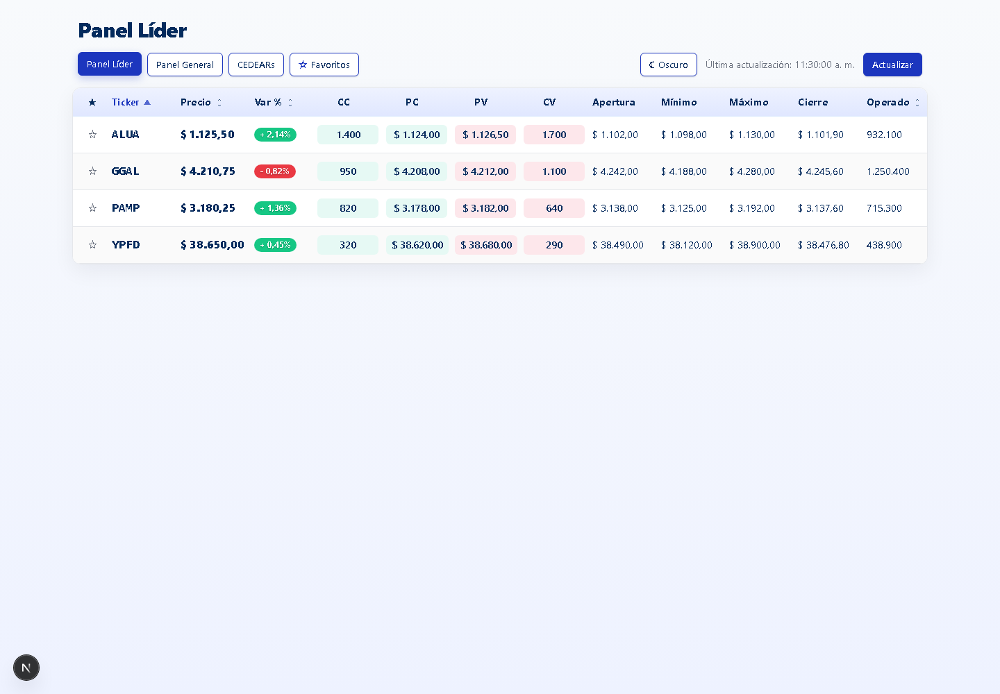
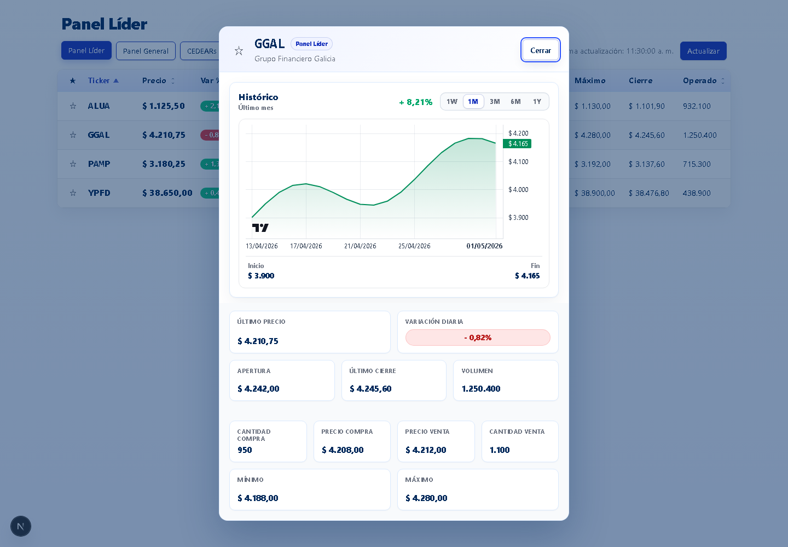
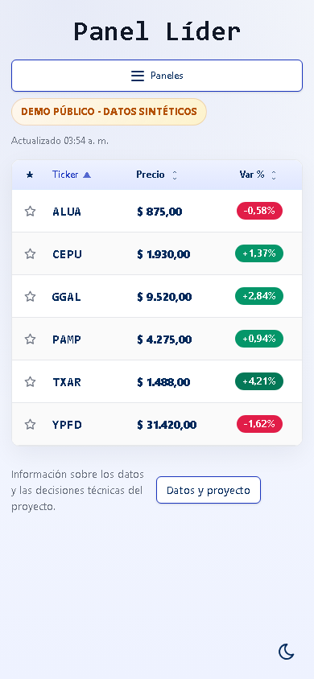

# Argentina Market Tracker

[](https://github.com/emanueltivano/argentina-market-tracker/actions/workflows/ci.yml)


Portfolio full-stack dashboard for Argentine equities built with Next.js, React
and TypeScript.

This project focuses on the kind of engineering decisions that matter in a real
frontend/full-stack review: server/client boundaries, validated external data,
SSR with App Router, resilient API routes, responsive UI states, automated
tests and production-aware tradeoffs.

It is a portfolio/demo project, not a live trading platform or a production
fintech system.

## What Problem It Solves

The app exposes market panels and per-symbol historical data from a protected
external API without leaking credentials to the browser.

The browser talks only to stable internal routes:

- `/api/panel?type=lider|general|cedears`
- `/api/stocks/[symbol]/history?range=...&market=...`

Those routes validate request input, normalize upstream payloads, apply local
cache/rate limiting rules, and return contracts the UI can render safely.

## Stack

- Next.js 16 App Router
- React 19
- TypeScript (strict)
- Tailwind CSS 4
- SWR
- `lightweight-charts`
- Vitest
- Playwright
- GitHub Actions

## Technical Highlights

- **Next.js App Router with SSR-first dashboard bootstrapping**
  - The initial dashboard panel is fetched on the server and hydrated into the
    client.
  - SWR remains responsible for client refresh and revalidation.

- **Secure backend-for-frontend**
  - External API credentials and OAuth handling stay server-side.
  - The browser never calls the market provider directly.

- **Runtime validation of external data**
  - Market panels and stock history payloads are normalized and validated before
    reaching the UI.
  - Partially invalid upstream payloads are rejected instead of being rendered
    silently.

- **Resilience against flaky external APIs**
  - Short in-memory caching
  - In-flight request deduplication
  - Manual refresh with cache bypass
  - Rate limiting and refresh cooldowns
  - Controlled error mapping for client-facing routes

- **Lightweight observability**
  - Route failures log structured server-side context without introducing
    external telemetry vendors.
  - Client fetch errors keep enough request context to debug invalid responses.

- **UI/UX states that reflect real data flows**
  - Loading, empty, success, error, refresh-in-progress and stale-data states
  - Favorites persisted locally, including stale snapshot fallback behavior
  - Historical modal with range switching and chart rendering

- **Professional validation path**
  - Unit tests
  - Route/integration-style tests
  - Hook/component tests
  - Playwright E2E against deterministic mocks

- **Accessibility and SEO polish**
  - Coherent metadata for social previews
  - Dialog focus restoration
  - Accessible action labels
  - Range selector state exposed via `aria-pressed`

## Architecture Overview

```txt
Browser
  Server-rendered dashboard shell + SWR hydration
        |
        | GET /api/panel?type=lider|general|cedears
        | GET /api/stocks/[symbol]/history?range=...
        v
Next API Routes
  Request validation, cache, cooldown, rate limit, normalization
        |
        v
Server-only IOL client
  OAuth token cache, timeout, retry, credential protection
        |
        v
External market API
```

The client works only with validated app-level data. Credentials, token refresh
and upstream-specific failure details stay in the server layer.

## Production Readiness

This project includes a practical, portfolio-sized production-readiness layer:

- server-only external API access
- runtime validation for external payloads
- stable internal response contracts
- SSR initial panel rendering with client revalidation
- in-memory cache and request deduplication
- local rate limiting and manual refresh cooldown
- structured route error logging
- responsive UI states for loading/error/empty/stale cases
- CI that runs lint, type-check, tests and build

Intentional tradeoffs:

- cache and rate limiting are in-memory and per process/serverless instance
- there is no distributed store such as Redis/KV
- there is no public telemetry vendor, tracing or alerting setup
- there is no public demo mode backed by mocked data yet

That makes the project credible as a portfolio piece without pretending to be a
full production trading system.

## Screenshots

### Desktop



### Historical Modal



### Mobile



## Local Setup

```bash
npm install
cp .env.local.example .env.local
npm run dev
```

Open `http://localhost:3000`.

Real market data requires valid external API credentials in `.env.local`.

## Environment Variables

Use `.env.local.example` as the reference file.

| Variable | Required | Description |
| --- | --- | --- |
| `API_URL` | Yes | External market API base URL, without trailing slash |
| `NEXT_PUBLIC_SITE_URL` | Recommended for public deploys | Public site URL for metadata/Open Graph |
| `TOKEN_ENDPOINT` | No | Token endpoint path, defaults to `token` |
| `API_USERNAME` | Yes | External API username |
| `API_PASSWORD` | Yes | External API password |
| `PANEL_LIDER_ENDPOINT` | Yes | Upstream endpoint for the leader panel |
| `PANEL_GENERAL_ENDPOINT` | Yes | Upstream endpoint for the general panel |
| `PANEL_CEDEARS_ENDPOINT` | Yes | Upstream endpoint for CEDEARs |
| `ENABLE_TOKEN_DEBUG` | No | Enables local-only debug routes when set to `1` |

Notes:

- keep real credentials only in `.env.local` and deployment environment
  variables
- only `NEXT_PUBLIC_SITE_URL` should be public
- set `NEXT_PUBLIC_SITE_URL` explicitly for any public deployment so social
  metadata resolves to the real public origin
- in production, the app no longer falls back silently to `http://localhost:3000`
  for `metadataBase`
- debug routes remain restricted to local development even when
  `ENABLE_TOKEN_DEBUG=1`

## Scripts

| Script | Description |
| --- | --- |
| `npm run dev` | Start Next.js in development on port `3000` |
| `npm run build` | Build the production app |
| `npm run start` | Serve the production build on port `3000` |
| `npm run lint` | Run ESLint |
| `npm run type-check` | Run TypeScript without emitting files |
| `npm run test` | Run Vitest |
| `npm run test:e2e` | Build and run Playwright E2E |
| `npm run test:e2e:run` | Run E2E against an existing production build |
| `npm run test:e2e:ui` | Open the Playwright UI runner |
| `npm run validate` | Run lint, type-check, unit/integration tests and build |

## Quality Gates

Recommended local validation before sharing or deploying:

```bash
npm run lint
npm run type-check
npm run test
npm run test:e2e
npm run build
```

For a faster pre-commit path:

```bash
npm run validate
```

## Testing

The test suite covers the highest-risk areas of the project:

- normalization of external market and history payloads
- token caching, retry and timeout behavior in the server-only API client
- internal API route contracts and error handling
- local cache/rate-limit/cooldown behavior
- hooks for panel loading, favorites and stock history
- component behavior for dashboard states and modal flows
- end-to-end dashboard interactions with deterministic mocks

Playwright runs against a production build and uses mocked internal API traffic
where appropriate, so the suite does not depend on live provider credentials.

First-time Playwright setup:

```bash
npx playwright install chromium
```

## CI

GitHub Actions is configured in [`.github/workflows/ci.yml`](./.github/workflows/ci.yml).

The CI pipeline runs:

```bash
npm ci
npm run lint
npm run type-check
npm run test
npm run build
npx playwright install --with-deps chromium
npm run test:e2e:run
```

## Repository Structure

```txt
src/
  app/
    api/
      panel/
      stocks/[symbol]/history/
      token/
    dashboard/
      components/
      hooks/
      lib/
    layout.tsx
    page.tsx
  lib/
    market.ts
    panel.ts
    stockHistory.ts
    server/
      env.ts
      iol.ts
      observability.ts
      panelCache.ts
      tokenCache.ts
```

## Limitations and Honest Tradeoffs

- No public deployment URL is documented yet.
- In-memory cache and rate limiting are intentionally simple and not shared
  across serverless instances.
- Historical data is fetched on demand and not persisted.
- There is no analytics, tracing or third-party error reporting vendor.
- The project is designed for portfolio review and technical discussion, not for
  real-money trading.

## Public Deploy Notes

- Use real upstream credentials only in controlled server-side environments, or
  add an explicit demo mode before publishing a public URL.
- `NEXT_PUBLIC_SITE_URL` should be set to the final public origin for correct
  social metadata. If it is omitted, production metadata will avoid a fake
  localhost origin instead of guessing one.
- Cache, cooldown and rate limiting are per instance in serverless
  environments; they are useful safeguards, not a global protection layer.

## Suggested Portfolio Positioning

Good GitHub description:

`Market dashboard for Argentine equities with a secure Next.js BFF, runtime-validated external data, historical charts, caching, rate limiting and automated tests.`

Suggested repository topics:

`nextjs`, `typescript`, `react`, `tailwindcss`, `playwright`, `vitest`, `portfolio`, `bff`, `financial-dashboard`

## Backlog

Follow-up ideas are tracked in [`docs/issues.md`](./docs/issues.md).
